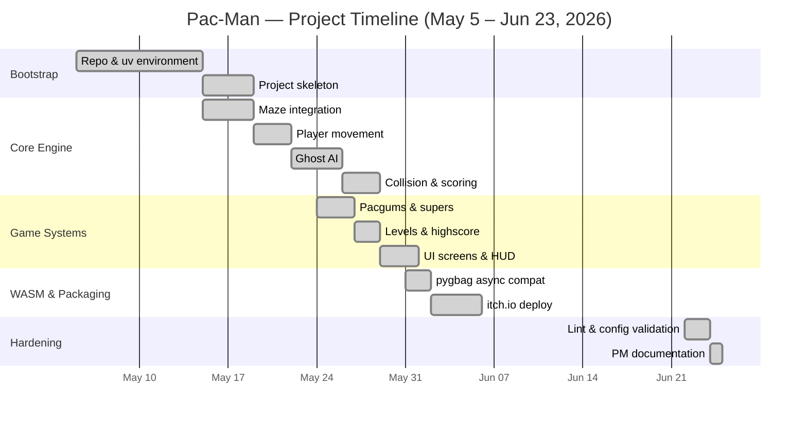

# Gantt Chart

Rendered inline by GitHub. To export a PNG for slides, click the chart in
the GitHub UI → "Download PNG".

Notes:
- Gaps in the calendar reflect parallel coursework, not blocked work.
- Phase boundaries align with milestone commits, not calendar weeks.
